# Level 2: Hello World Roundup
1st Jan - 13th Feb 2021

Our second #GamesNightViz theme ["Hello World"](https://github.com/wjsutton/games_night_viz/blob/main/2_hello_world.md), had us traversing through different game worlds, meeting new people, finding the best places to stay or just trying to survive.

The project ran alongside [Tableau's Iron Viz competition](https://www.tableau.com/community/iron-viz) and we received 21 submissions! 

## Data Prep Submissions

On the data prep side, <a href='https://twitter.com/abmcknight18/status/1478931510032056320'>Alice S.</a> helped us survive against [C.Liam Brown's Battleship AI](https://github.com/wjsutton/games_night_viz/blob/main/2_hello_world.md#data-preparation-challenge-cliam-brown-sunk-my-battleship) challenge.

## Data Visualisation Submissions

We received 20 visualisations covering several games but some popular choices included: 
- Skyrim,
- Minecraft, 
- and Mario

Check out these great vizzes :point_down:

<h3><a href='https://github.com/aaronsfox/games-night-viz/tree/master/data_viz/level_2/retro_modern_mario_bros' target='_blank'>Retro Modern Mario Bros #Genuary by Aaron Fox </a></h3><i>These are really great visualizations – if you zoom in, the detail on how they were created makes it even more impressive. – Tina</i><a href='https://github.com/aaronsfox/games-night-viz/tree/master/data_viz/level_2/retro_modern_mario_bros' target='_blank'>
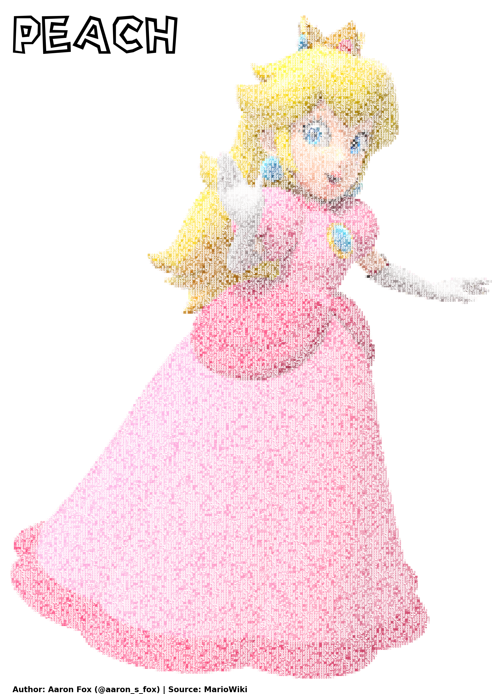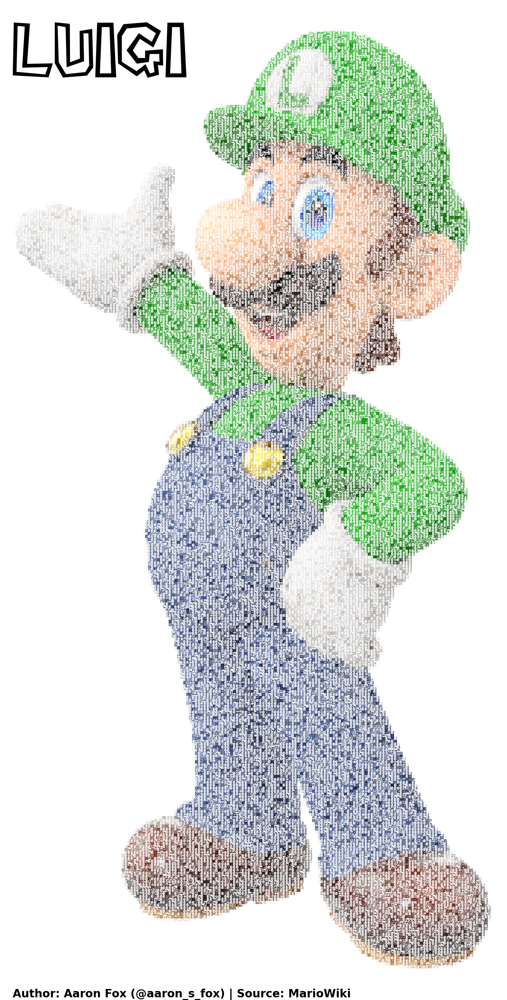</a>

<h3><a href='https://public.tableau.com/app/profile/ant.pulley/viz/SkyrimCensus-Year201ofthe4thEra/SkyrimCensus' target='_blank'>Skyrim Census - Year 201 of the 4th Era | VOTD by Ant Pulley by Ant Pulley </a></h3><i>This viz is an RPG enthusiasts dream! Ant visualizations are always so creative – the big easter egg here is in the “info button”. The interactive map within the show/hide button is pure sorcery. - Tina</i><a href='https://public.tableau.com/app/profile/ant.pulley/viz/SkyrimCensus-Year201ofthe4thEra/SkyrimCensus' target='_blank'>
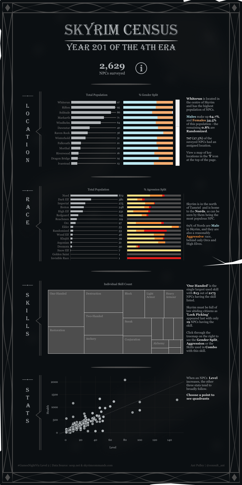</a>

<h3><a href='https://public.tableau.com/app/profile/edvard.stepancuk/viz/PUBG_16442473498050/Dashboard1?publish=yes' target='_blank'>#GamesNightViz PUBG by Edvard Stepancuk by Edvard Stepancuk </a></h3><i>A great interactive map Edvard, love that you've added animation too! I had a theory with this dataset that there would be a lot of activity around the military base early game, from your viz it looks like everyone starts trying to escape after 7 mins! Awesome work! 🏆 – Will</i><a href='https://public.tableau.com/app/profile/edvard.stepancuk/viz/PUBG_16442473498050/Dashboard1?publish=yes' target='_blank'>
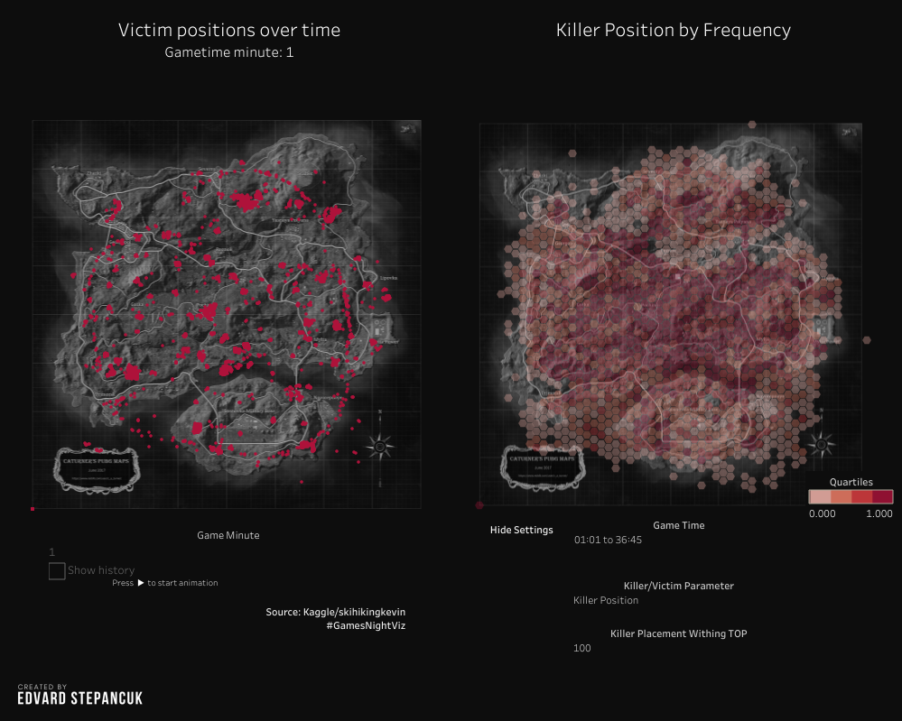</a>

<h3><a href='https://public.tableau.com/app/profile/gemma.francisco/viz/WelcometoParadiseerCalamansigamesnightviz/CalamansiIsle' target='_blank'>Welcome to Paradise, er, Calamansi #gamesnightviz by Gemma Francisco by Gemma Francisco </a></h3><i>The art style is so inviting and cute, and looks like this is not your first rodeo with #gamesnightviz! Keep it coming, we love it! 🥰 – Louis</i><a href='https://public.tableau.com/app/profile/gemma.francisco/viz/WelcometoParadiseerCalamansigamesnightviz/CalamansiIsle' target='_blank'>
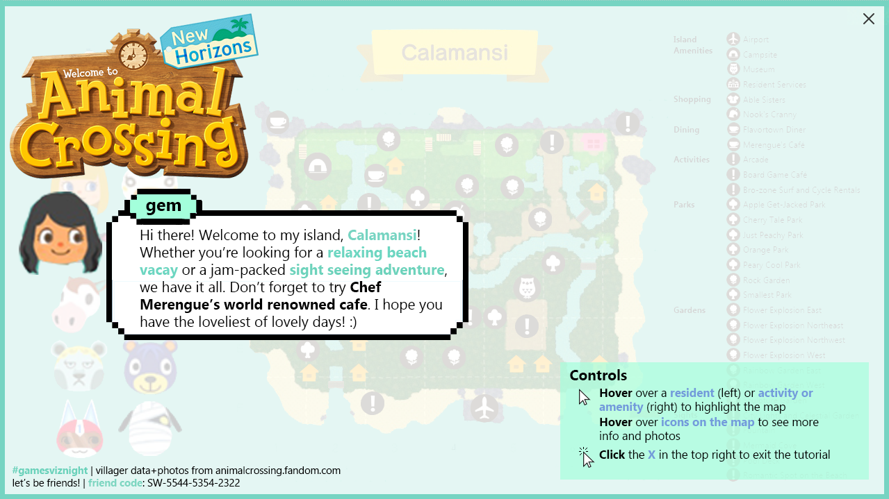</a>

<h3><a href='https://public.tableau.com/app/profile/jacob.turner/viz/FindTrueLoveinSKYRIM/Intro' target='_blank'>Find True Love in SKYRIM by Jacob Turner by Jacob Turner </a></h3><i>Who doesn’t love a good survey? Combine that with the comedy and subtle, extremely intricate details of this “love” survey based on Skyrim and you’ve got a Skyrim lovers dream! – Tina</i><a href='https://public.tableau.com/app/profile/jacob.turner/viz/FindTrueLoveinSKYRIM/Intro' target='_blank'>
</a>

<h3><a href='https://public.tableau.com/app/profile/jacob.turner/viz/SkyrimFollowers/SkyrimFollowerFinder' target='_blank'>Find a Follower in SKYRIM by Jacob Turner by Jacob Turner </a></h3><i>Loving the viz Jacob! I like how you've found your own story amongst that big dataset - I think the tertiary plot works nicely to show the 3 stats, any views on the best follower? Love the map & icons! 🤩  - Will</i><a href='https://public.tableau.com/app/profile/jacob.turner/viz/SkyrimFollowers/SkyrimFollowerFinder' target='_blank'>
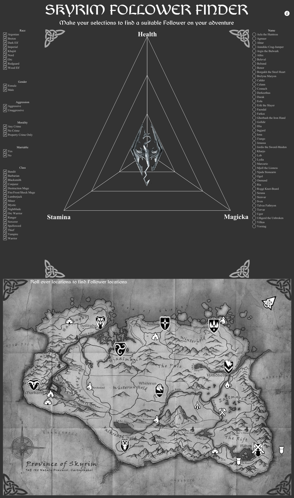</a>

<h3><a href='https://public.tableau.com/app/profile/joshpreston/viz/MariosNemesesGamesNightViz/Dashboard1?publish=yes' target='_blank'>Mario's Nemeses #GamesNightViz by Joshua Preston by Joshua Preston </a></h3><i>Great looking viz Josh! Love the colours and that heatmap works really well for this dataset - interesting how in later levels the green koopa troopas get upgraded to paratroopas! – Will</i><a href='https://public.tableau.com/app/profile/joshpreston/viz/MariosNemesesGamesNightViz/Dashboard1?publish=yes' target='_blank'>
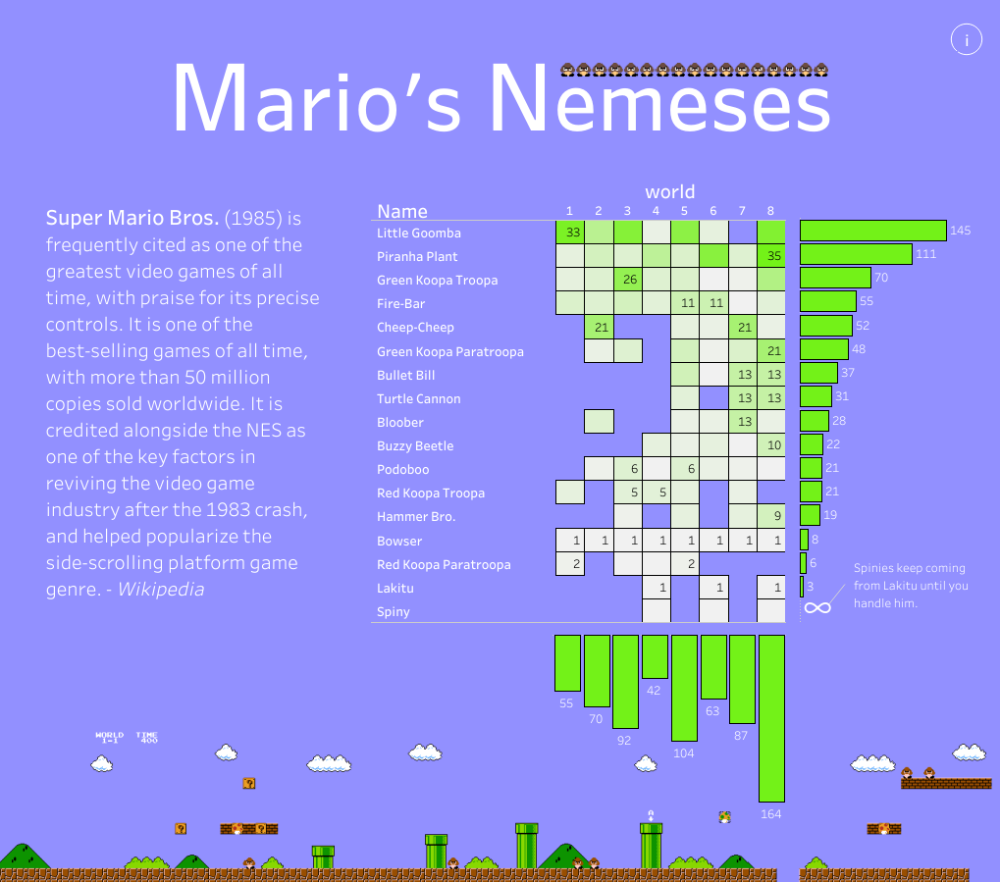</a>

<h3><a href='https://public.tableau.com/app/profile/joshpreston/viz/NintendoLife2021Reviews/Dashboard1' target='_blank'>Nintendo Life 2021 Reviews by Joshua Preston by Joshua Preston </a></h3><i>If you were ever looking for a quick hit review on a game, this viz is for you. Josh incorporates the articles of reviewers from Nintendo Life within this visualization, creating ease of organization and a portfolio for the reviewers. – Tina</i><a href='https://public.tableau.com/app/profile/joshpreston/viz/NintendoLife2021Reviews/Dashboard1' target='_blank'>
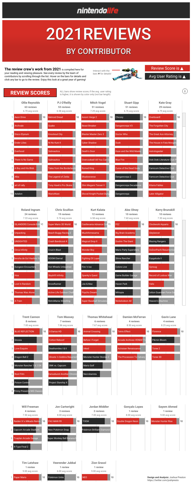</a>

<h3><a href='https://public.tableau.com/app/profile/joshpreston/viz/TheMetroidvaniaVideoGameSubgenre2010-2021/Dashboard1' target='_blank'>The Metroidvania Video Game Subgenre 2010-2021 by Joshua Preston by Joshua Preston </a></h3><i>Another awesome #GamesNightViz Josh! Great explanation of the subgenre because I wasn't too sure! I'm having a great time exploring the bottom section there are a few games I know but many are new to me - definitely a genre I'll dive into soon! 🤩- Will</i><a href='https://public.tableau.com/app/profile/joshpreston/viz/TheMetroidvaniaVideoGameSubgenre2010-2021/Dashboard1' target='_blank'>
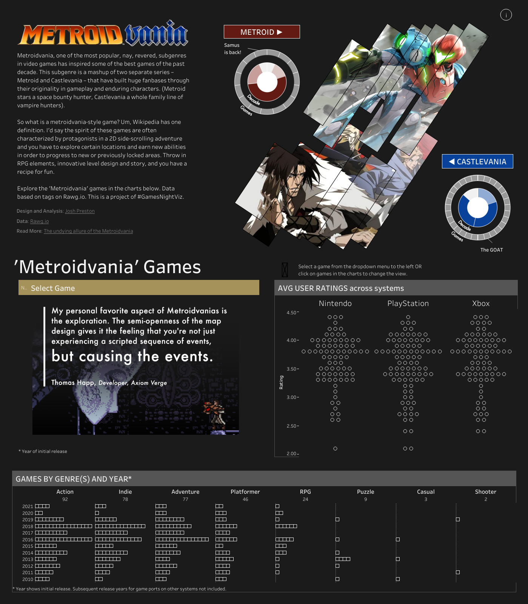</a>

<h3><a href='https://public.tableau.com/app/profile/kate.kohn/viz/KantoRegionPopulationDensityMap/Dashboard1' target='_blank'>Kanto Region Population Density Map by Kate Kohn by Kate Kohn </a></h3><i>Game vizzes that show IRL locations are always a fun twist and bring another level of sentiment to those that enjoy playing! – Tina</i><a href='https://public.tableau.com/app/profile/kate.kohn/viz/KantoRegionPopulationDensityMap/Dashboard1' target='_blank'>
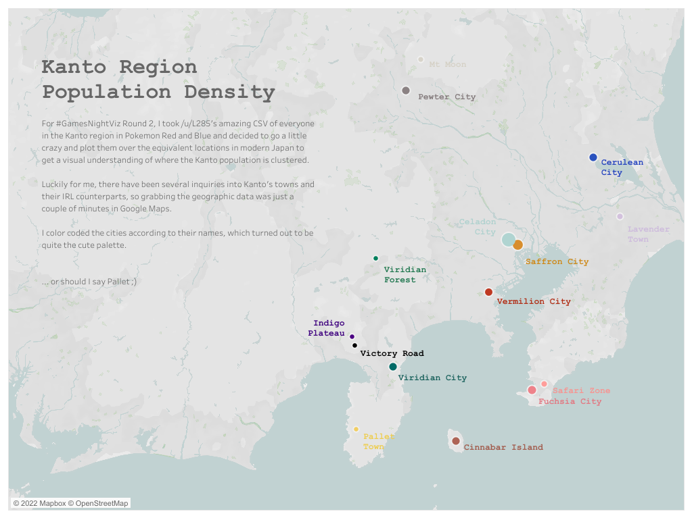</a>

<h3><a href='https://public.tableau.com/app/profile/kevin.flerlage/viz/VegasVacationCheapoCasinoTEST/VegasVacationCheapoCasino' target='_blank'>Vegas Vacation Cheapo Casino by Kevin Flerlage by Kevin Flerlage </a></h3><i>Will lost every game, as did I, but it didn’t make it any less fun. The artwork is fantastic and the reaction times are so quick making this an enjoyable experience. I hope Kevin isn’t keeping a tab. – Tina</i><a href='https://public.tableau.com/app/profile/kevin.flerlage/viz/VegasVacationCheapoCasinoTEST/VegasVacationCheapoCasino' target='_blank'>
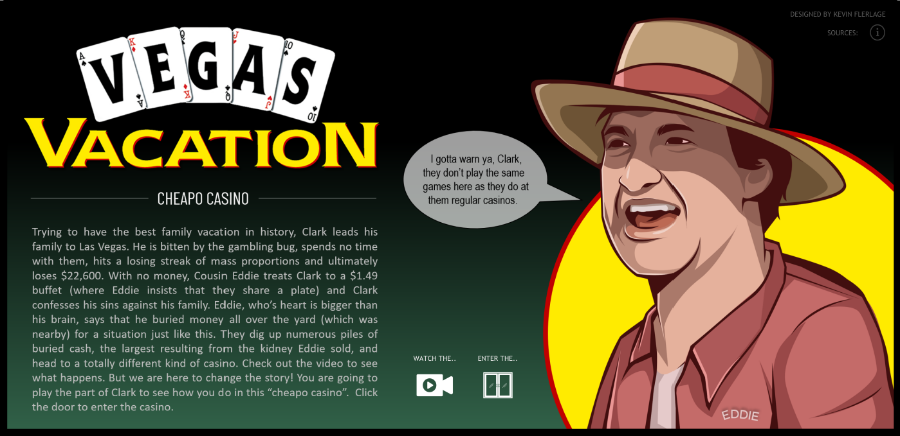</a>

<h3><a href='https://public.tableau.com/app/profile/kimberly.furdell/viz/monopoly_gamesnight2/Dashboard1?publish=yes' target='_blank'>The Many Worlds of Monopoly by Kimberly Furdell, Ph.D. by Kimberly Furdell, Ph.D. </a></h3><i>Loving the viz Kimberly! You’ve real nailed that monopoly look & feel - I even feel nervous seeing that many hotels on sports! Great callouts & BANs they really help with interpreting the data! 💰💰💰- Will</i><a href='https://public.tableau.com/app/profile/kimberly.furdell/viz/monopoly_gamesnight2/Dashboard1?publish=yes' target='_blank'>
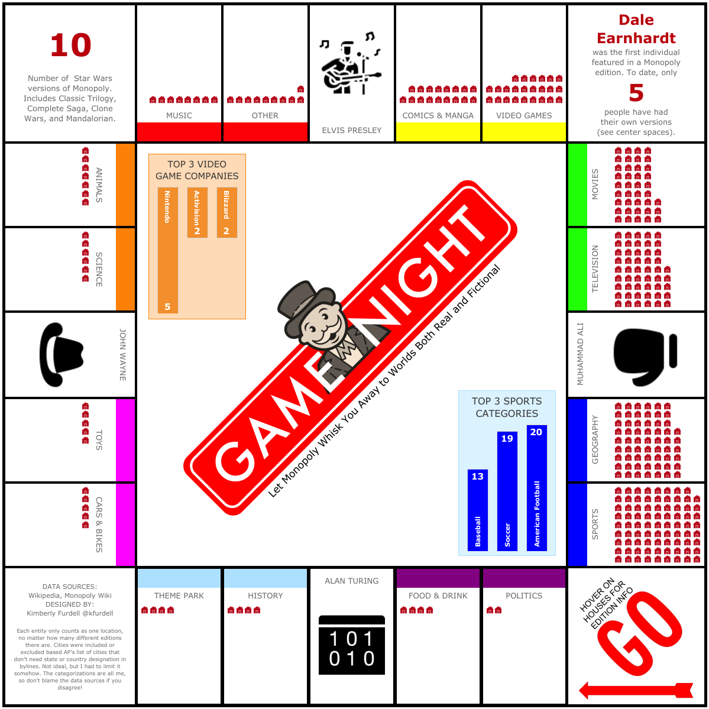</a>

<h3><a href='https://public.tableau.com/app/profile/louisyu/viz/WelcometothePixelWorld/Howitallcameabout' target='_blank'>Welcome to the Pixel World by Louis Yu by Louis Yu </a></h3><i>I believe Louis said he put this visualization for the #IronViz qualifier together in a weekend, which makes it that much more impressive, because all of the artwork is data! I love this viz, it is so creative and look forward to the future pixel art tutorial 😉. – Tina</i><a href='https://public.tableau.com/app/profile/louisyu/viz/WelcometothePixelWorld/Howitallcameabout' target='_blank'>
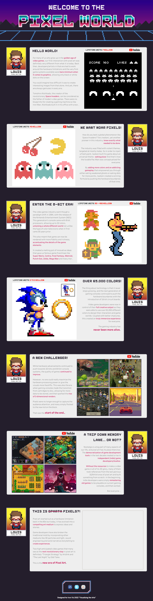</a>

<h3><a href='https://public.tableau.com/app/profile/megan.whitacre/viz/Jan22GamesNightVizMinecraftMaterials/Dashboard1' target='_blank'>Jan 22 #GamesNightViz: Minecraft Materials by Megan Whitacre by Megan Whitacre </a></h3><i>Great work Megan! I think the trellis works really well with this long dataset and those treemaps really give it that blocky feel! Love the captions - insightful & helpful for explaining the data - Will</i><a href='https://public.tableau.com/app/profile/megan.whitacre/viz/Jan22GamesNightVizMinecraftMaterials/Dashboard1' target='_blank'>
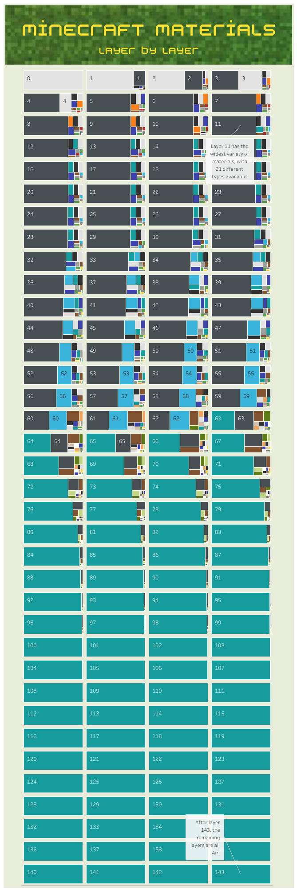</a>

<h3><a href='https://public.tableau.com/app/profile/nir.smilga/viz/MinecraftBlocksDistperLayer_16438944312130/MinecraftBlocksDistbyLayer' target='_blank'>Minecraft Blocks Dist per Layer by ‫Nir Smilga‬‎ by ‫Nir Smilga‬‎ </a></h3><i>This is awesome work Nir! I love how you used the original block images as a filter for the entire map. Great job! 👍👍👍- Louis</i><a href='https://public.tableau.com/app/profile/nir.smilga/viz/MinecraftBlocksDistperLayer_16438944312130/MinecraftBlocksDistbyLayer' target='_blank'>
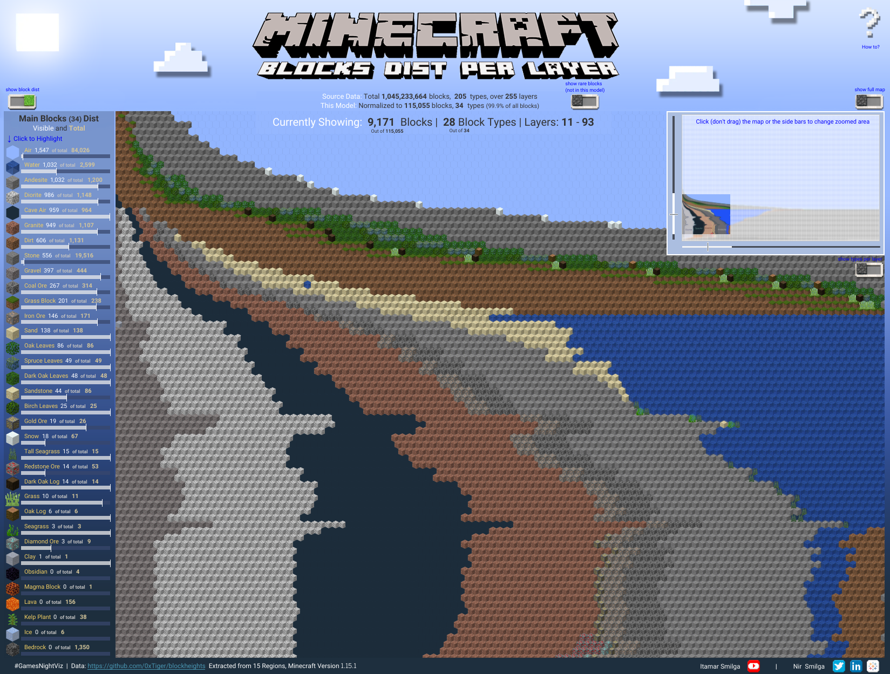</a>

<h3><a href='https://public.tableau.com/app/profile/stefan.melgaard/viz/LucasArtsPointClickGamesDashboard/Dashboard' target='_blank'>LucasArts Early 90s Point & Click Games by Stefan Melgaard by Stefan Melgaard </a></h3><i>Great work Stefan! Really like how you've used python to prep you're own data and then built a viz - makes for some serious skills! Those images really put you back in the game and give good nostalgia vibes - I especially love the Indiana Jones one! I hate snakes! 🤣 - Will</i><a href='https://public.tableau.com/app/profile/stefan.melgaard/viz/LucasArtsPointClickGamesDashboard/Dashboard' target='_blank'>
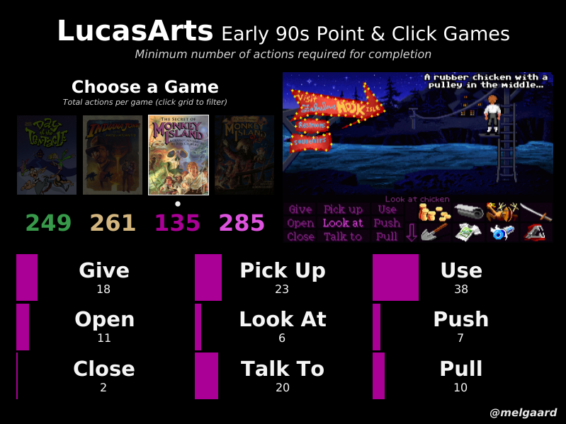</a>

<h3><a href='https://public.tableau.com/app/profile/turner.family/viz/LinktothePastdungeonenemiesSon2/LTTPEnemiesbydungeon_1' target='_blank'>Link to the Past dungeon enemies (Son #2) by Turner family by Turner family </a></h3><i>For this to have been completed by Jacob’s 12 year old son is extremely impressive! Well done! – Tina</i><a href='https://public.tableau.com/app/profile/turner.family/viz/LinktothePastdungeonenemiesSon2/LTTPEnemiesbydungeon_1' target='_blank'>
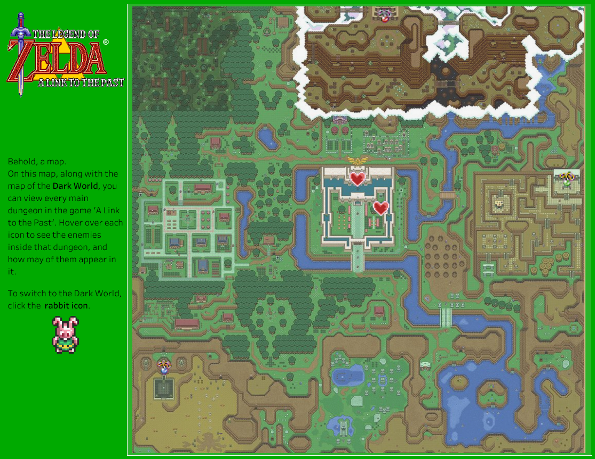</a>

<h3><a href='https://public.tableau.com/app/profile/turner.family/viz/YoshisIslandMemoryGame/YoshisMemoryGame' target='_blank'>Yoshi's Island Memory Game by Turner family </a></h3><i>A really nice example of building a game in Tableau and the Yoshi's Island theme makes this really fun and great practice for math class! - Will</i><a href='https://public.tableau.com/app/profile/turner.family/viz/YoshisIslandMemoryGame/YoshisMemoryGame' target='_blank'>
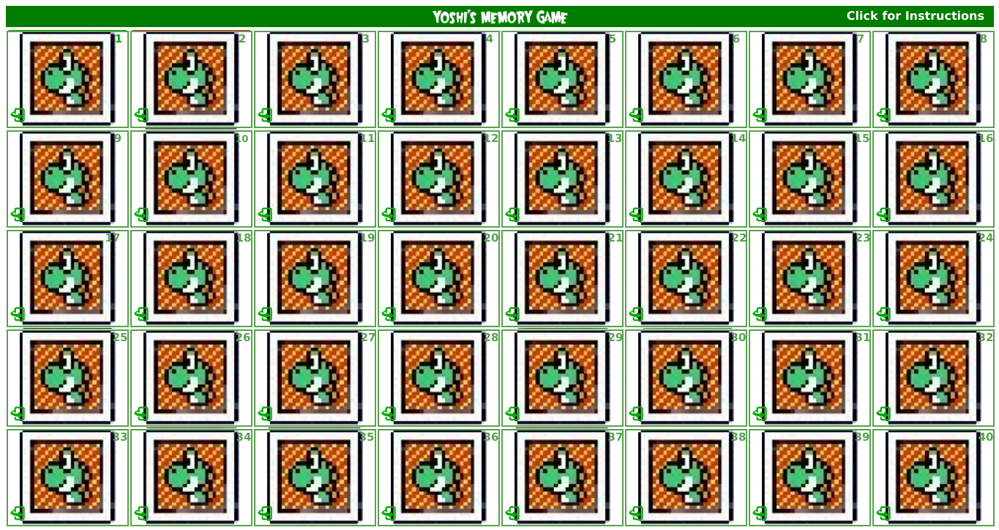</a>

<h3><a href='https://public.tableau.com/app/profile/valent.jonathan/viz/StreetFighterVCharacterStatistics/SFVCharStats' target='_blank'>Street Fighter V Character Statistics by Valent Jonathan by Valent Jonathan </a></h3><i>This really plays well into the nostalgia of old games. This is great! – Tina</i><a href='https://public.tableau.com/app/profile/valent.jonathan/viz/StreetFighterVCharacterStatistics/SFVCharStats' target='_blank'>
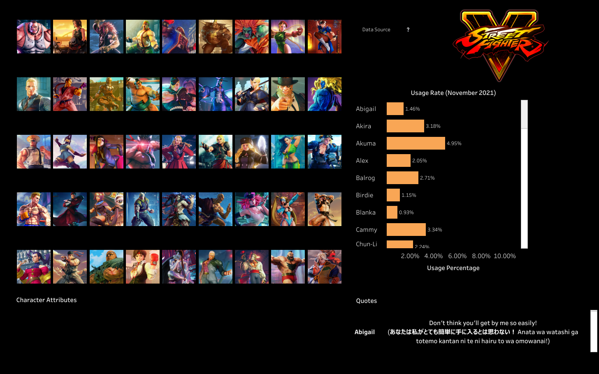</a>

<h3><a href='https://public.tableau.com/app/profile/wjsutton/viz/InterpretingArtIronViz2022Drawful2/Dash' target='_blank'>Interpreting Art | Iron Viz 2022 | Drawful 2 by Will Sutton by Will Sutton </a></h3><i>Will’s #IronViz qualifier is so fun. If you took the quiz, it was a lot of fun to interpret for yourself and the entire viz is within this “sketch-world” theme. Really well done, Will! – Tina</i><a href='https://public.tableau.com/app/profile/wjsutton/viz/InterpretingArtIronViz2022Drawful2/Dash' target='_blank'>
</a>

