# Level 3: Hello World Roundup
14th Feb - 31st Mar 2022

Our third #GamesNightViz theme ["Powering Up"](https://github.com/wjsutton/games_night_viz/blob/main/3_powering_up.md), had us improving our abilities, getting stronger and finding the key items.

The project ran a collab with [Back 2 Viz Basics | Week 6 Dealing with Outliers](https://data.world/back2vizbasics/2022week-6-dealing-with-outliers)

We also had a data prep collab with our friends [Preppin' Data | Week 8 Pokémon Evolution Stats](https://preppindata.blogspot.com/2022/02/2022-week-8-pokemon-evolution-stats.html)

## Data Visualisation Submissions

We received 26 visualisations featuring
- lots of Mario thanks to the [B2VB Collab]((https://data.world/back2vizbasics/2022week-6-dealing-with-outliers)
- the Witcher from [#DataFamCon's first challenge, Toss a Coin to your Witcher](https://medium.com/@datafamcon/january-2022-toss-a-coin-to-your-witcher-3c38f8d8550d)
- and music from games thanks to [#DataPlusMusic's Let's analyze MIDI files challenge](https://www.hipstervizninja.com/blog/midi-analysis/)

Check out these great vizzes :point_down:

<h3><a href='https://public.tableau.com/app/profile/abdelhaq.bensghir/viz/SuperMario_jeux/Dashboard1?publish=yes'>Back to visual basics (B2VB) _ outliers by Abdelhaq BENSGHIR </a></h3><i></i><a href='https://public.tableau.com/app/profile/abdelhaq.bensghir/viz/SuperMario_jeux/Dashboard1?publish=yes'>
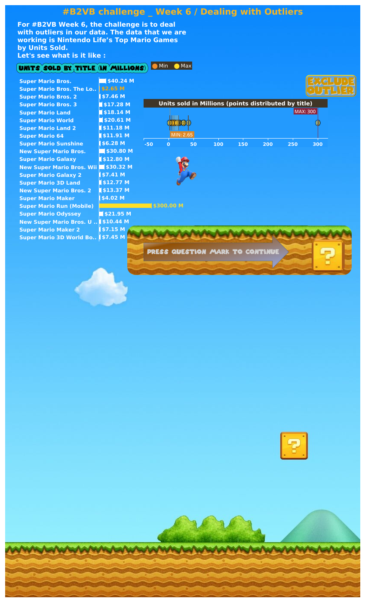</a>

<h3><a href='https://public.tableau.com/app/profile/bkornell/viz/SuperMarioSales_16476425362160/SuperMarioSales'>Super Mario Sales by Branden Kornell </a></h3><i></i><a href='https://public.tableau.com/app/profile/bkornell/viz/SuperMarioSales_16476425362160/SuperMarioSales'>
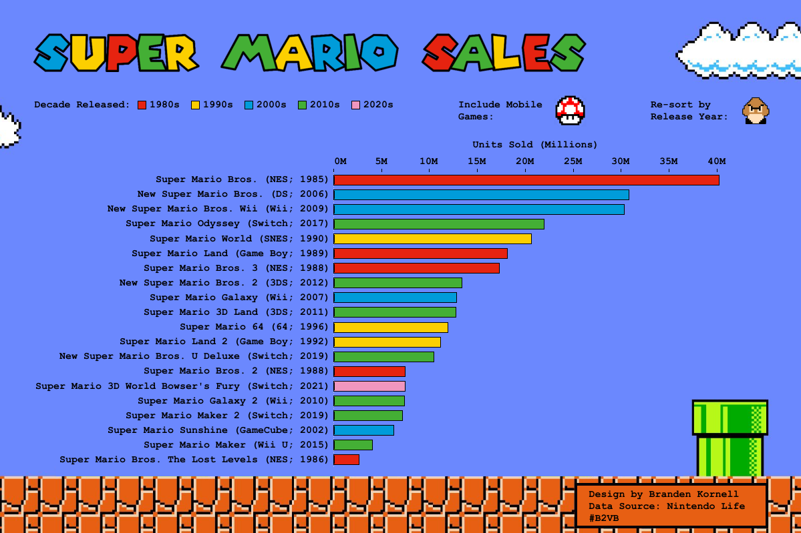</a>

<h3><a href='https://public.tableau.com/app/profile/christina.andino/viz/B2VBWeek6_16473414499230/Dashboard1'>Which is the best selling Mario game? by Christina Andino </a></h3><i></i><a href='https://public.tableau.com/app/profile/christina.andino/viz/B2VBWeek6_16473414499230/Dashboard1'>
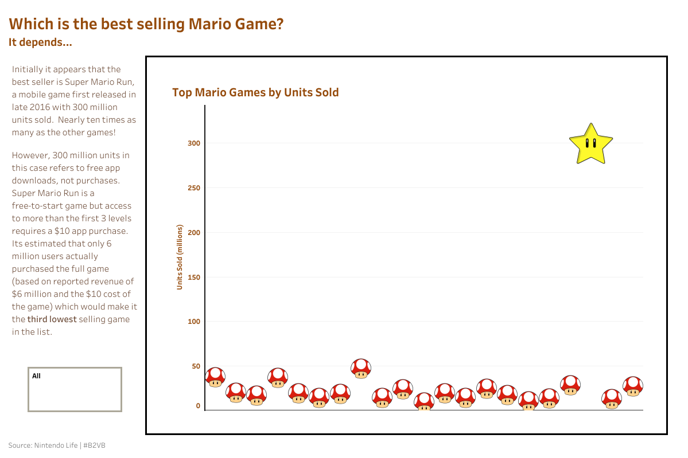</a>

<h3><a href='https://public.tableau.com/app/profile/elisa.davis/viz/TossaCointoyourWitcherDataFamCon/TossACoin'>Toss a Coin to your Witcher #DataFamCon by Elisa Davis </a></h3><i></i><a href='https://public.tableau.com/app/profile/elisa.davis/viz/TossaCointoyourWitcherDataFamCon/TossACoin'>
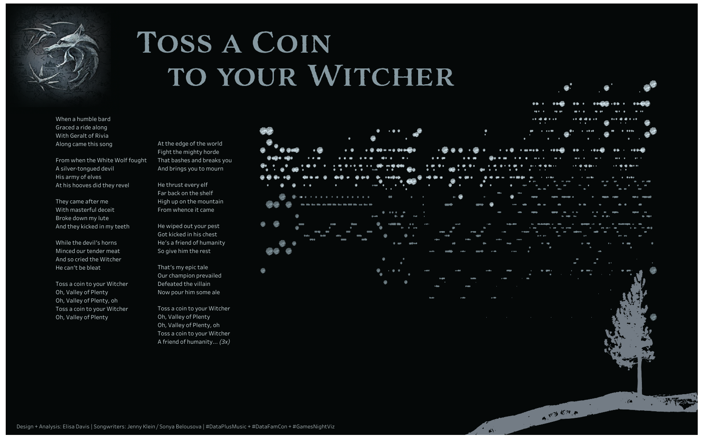</a>

<h3><a href='https://public.tableau.com/app/profile/elisa.davis/viz/MarioDataPlusMusic/Lets-a-go?publish=yes'>Mario #DataPlusMusic by Elisa Davis </a></h3><i></i><a href='https://public.tableau.com/app/profile/elisa.davis/viz/MarioDataPlusMusic/Lets-a-go?publish=yes'>
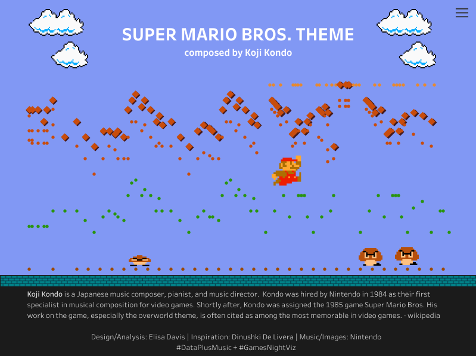</a>

<h3><a href='https://public.tableau.com/app/profile/jack.hineman/viz/B2VB2022Week06-IdentifyingOutliers/B2VB2022Week06IdentifyingOutliers?publish=yes'>#B2VB 2022 Week 06 - Identifying Outliers by Jack Hineman </a></h3><i></i><a href='https://public.tableau.com/app/profile/jack.hineman/viz/B2VB2022Week06-IdentifyingOutliers/B2VB2022Week06IdentifyingOutliers?publish=yes'>
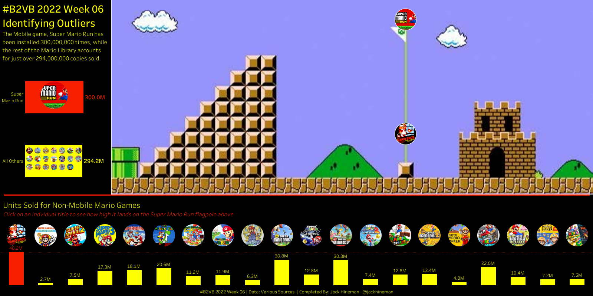</a>

<h3><a href='https://public.tableau.com/app/profile/.84558088/viz/B2VB_W6_TopMarioGames/12'>B2VB_W6_Top Mario Games by Jeff (高子翔) </a></h3><i></i><a href='https://public.tableau.com/app/profile/.84558088/viz/B2VB_W6_TopMarioGames/12'>
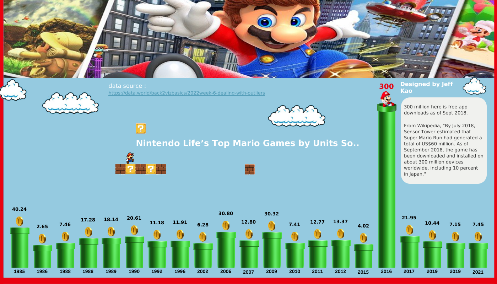</a>

<h3><a href='https://public.tableau.com/views/WitcherMonsterGuide/Dashboard1?:language=en-US&publish=yes&:display_count=n&:origin=viz_share_link:showVizHome=no'>Witcher Monster Guide by Joshua Preston </a></h3><i></i><a href='https://public.tableau.com/views/WitcherMonsterGuide/Dashboard1?:language=en-US&publish=yes&:display_count=n&:origin=viz_share_link:showVizHome=no'>
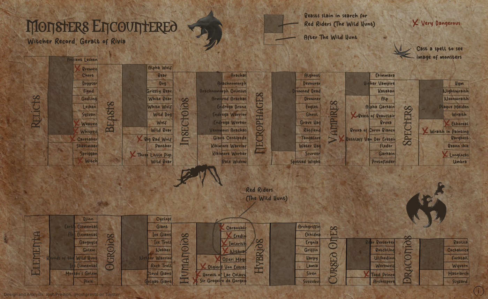</a>

<h3><a href='https://public.tableau.com/app/profile/joshpreston/viz/MariosNemesesGamesNightViz/Dashboard1?publish=yes'>Mario's Nemeses #GamesNightViz by Joshua Preston </a></h3><i></i><a href='https://public.tableau.com/app/profile/joshpreston/viz/MariosNemesesGamesNightViz/Dashboard1?publish=yes'>
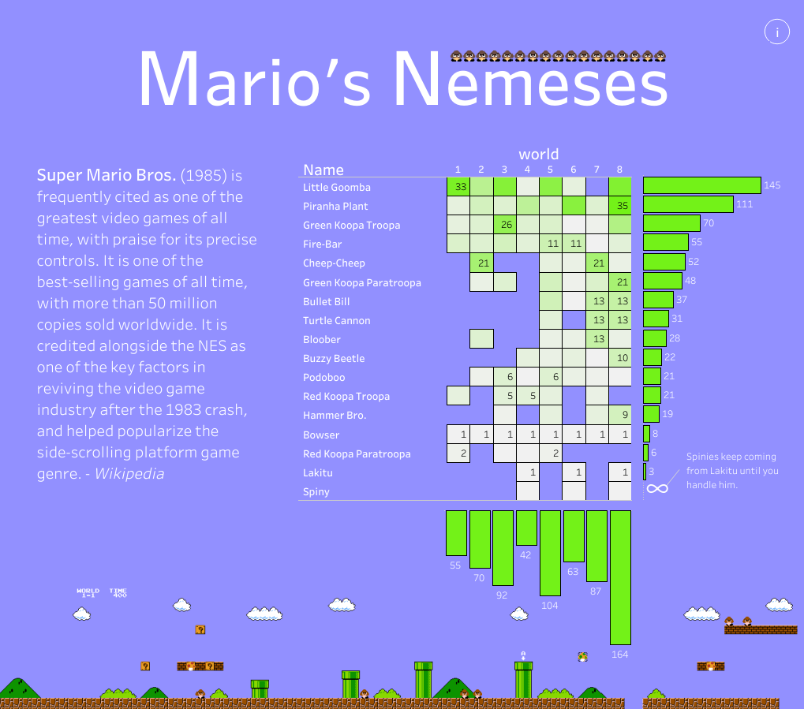</a>

<h3><a href='https://public.tableau.com/views/MarioGameSalesbyPlatformB2VBGamesNightViz/MarioGameSalesbyPlatform?:language=en-US&publish=yes&:display_count=n&:origin=viz_share_link:showVizHome=no'>Mario Game Sales by Platform #B2VB #GamesNightViz by Kayla Swain </a></h3><i></i><a href='https://public.tableau.com/views/MarioGameSalesbyPlatformB2VBGamesNightViz/MarioGameSalesbyPlatform?:language=en-US&publish=yes&:display_count=n&:origin=viz_share_link:showVizHome=no'>
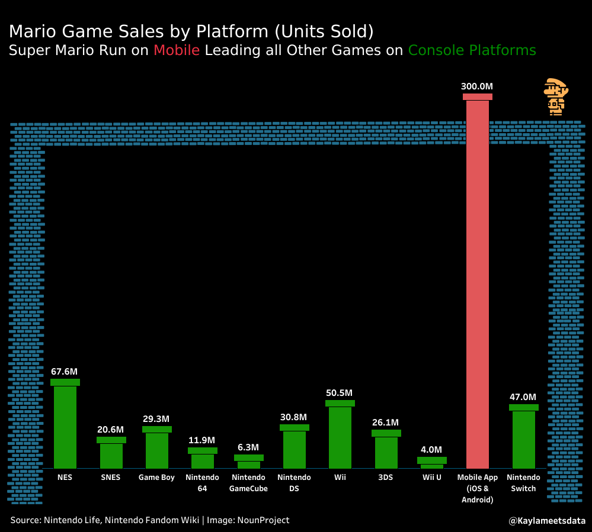</a>

<h3><a href='https://public.tableau.com/app/profile/lea.tan/viz/B2VBweek6challenge-dealingwithoutlier/B2VBweek6challenge'>#B2VB week 6 challenge - dealing with outlier by Lea Chua Tan </a></h3><i></i><a href='https://public.tableau.com/app/profile/lea.tan/viz/B2VBweek6challenge-dealingwithoutlier/B2VBweek6challenge'>
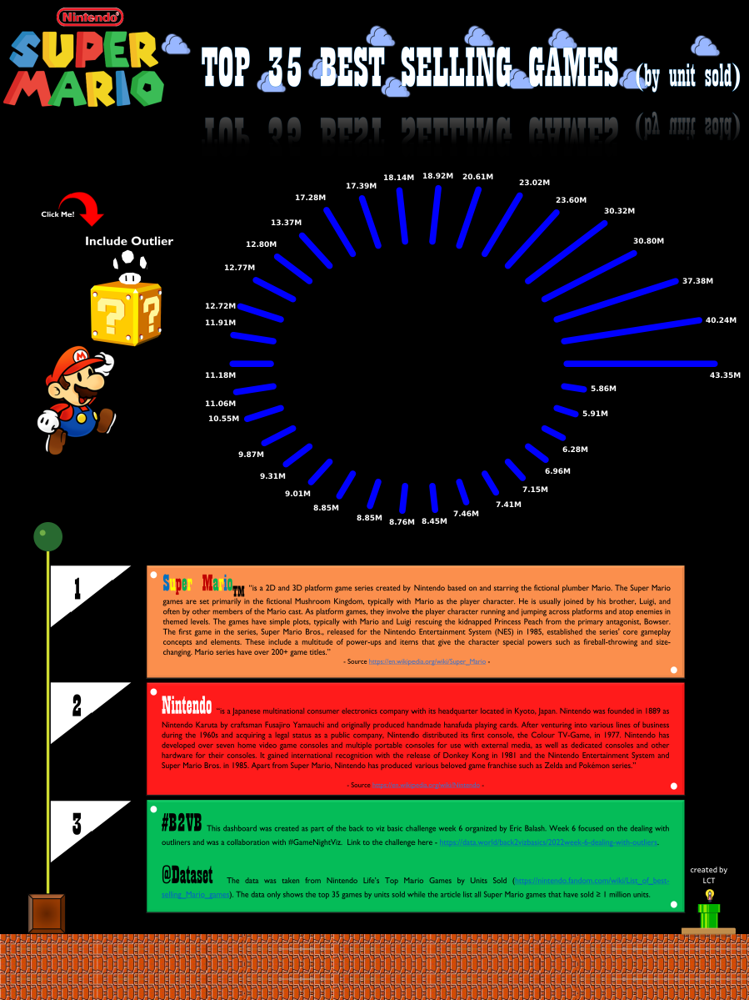</a>

<h3><a href='https://public.tableau.com/app/profile/luke.abraham/viz/MarioSalesB2VBDealingwithOutliers/MarioSales'>Mario Sales | #B2VB Dealing with Outliers by Luke Abraham </a></h3><i></i><a href='https://public.tableau.com/app/profile/luke.abraham/viz/MarioSalesB2VBDealingwithOutliers/MarioSales'>
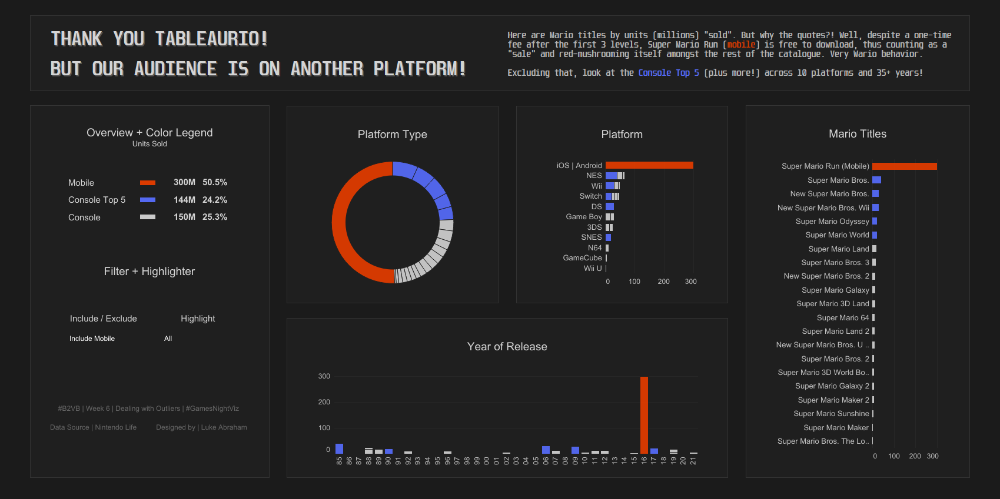</a>

<h3><a href='https://public.tableau.com/app/profile/max4890/viz/Back2VizBasics2022Week6-Mariooutlier/Dashboard1'>Back 2 Viz Basics 2022 Week 6 - Mario outlier by Max </a></h3><i></i><a href='https://public.tableau.com/app/profile/max4890/viz/Back2VizBasics2022Week6-Mariooutlier/Dashboard1'>
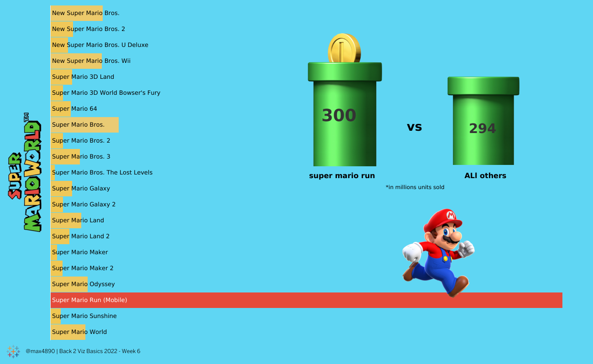</a>

<h3><a href='https://public.tableau.com/app/profile/quentin.miller/viz/SuperMarioBrotherSalesB2VBweek6/MarioSales'>Super Mario Brother Sales #B2VB week 6 by Quentin Miller </a></h3><i></i><a href='https://public.tableau.com/app/profile/quentin.miller/viz/SuperMarioBrotherSalesB2VBweek6/MarioSales'>
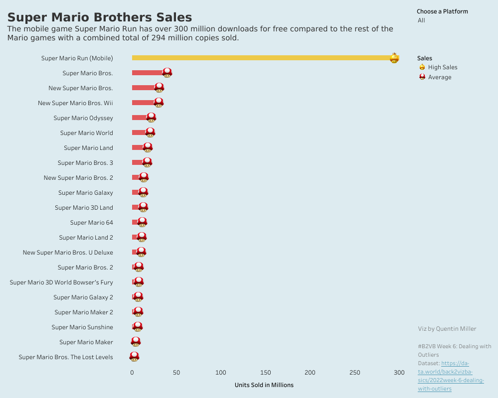</a>

<h3><a href='https://public.tableau.com/app/profile/rado.zatovic/viz/B2VBWEEK6BESTSELLINGMARIOGAMES/MARIO'>#B2VB WEEK 6 | BEST SELLING MARIO GAMES by Rado Zatovic </a></h3><i></i><a href='https://public.tableau.com/app/profile/rado.zatovic/viz/B2VBWEEK6BESTSELLINGMARIOGAMES/MARIO'>
</a>

<h3><a href='https://public.tableau.com/app/profile/rebecca.finlay/viz/MonopolysBestValuedStreetsandUpgrades/MonopolysBestValuedStreetsandUpgrades'>Monopoly's Best Valued Streets and Upgrades by Rebecca Finlay </a></h3><i></i><a href='https://public.tableau.com/app/profile/rebecca.finlay/viz/MonopolysBestValuedStreetsandUpgrades/MonopolysBestValuedStreetsandUpgrades'>
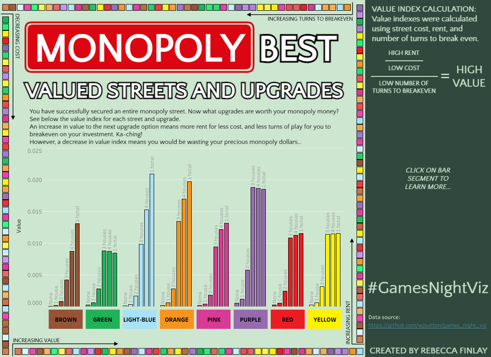</a>

<h3><a href='https://public.tableau.com/app/profile/rika.fujiwara/viz/B2VB_w06DealingwithOutliers/Dashboard'>#B2VB_w06 Dealing with Outliers by Rika Fujiwara </a></h3><i></i><a href='https://public.tableau.com/app/profile/rika.fujiwara/viz/B2VB_w06DealingwithOutliers/Dashboard'>
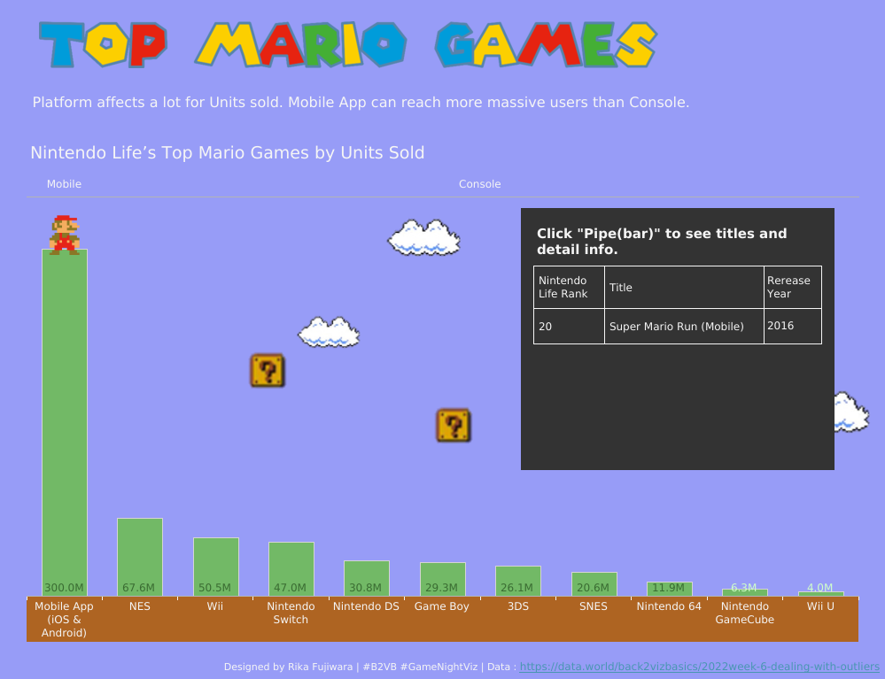</a>

<h3><a href='https://public.tableau.com/app/profile/sam.epley/viz/B2VB2022Week6TopMarioGames/B2VB2022Week6TopMarioGames'>#B2VB 2022 Week 6: Top Mario Games by Sam Epley </a></h3><i></i><a href='https://public.tableau.com/app/profile/sam.epley/viz/B2VB2022Week6TopMarioGames/B2VB2022Week6TopMarioGames'>
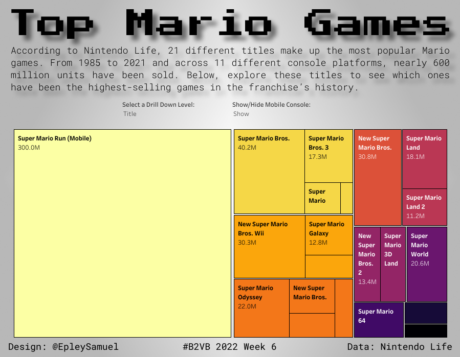</a>

<h3><a href='https://public.tableau.com/app/profile/shanetreynolds6/viz/NintendoxMarioSalesBacktoVizBasicsWeek6/NintendoxMarioSalesBacktoVizBasicsWeek6'>Nintendo x Mario Sales | Back to Viz Basics Week 6 by Shane Reynolds </a></h3><i></i><a href='https://public.tableau.com/app/profile/shanetreynolds6/viz/NintendoxMarioSalesBacktoVizBasicsWeek6/NintendoxMarioSalesBacktoVizBasicsWeek6'>
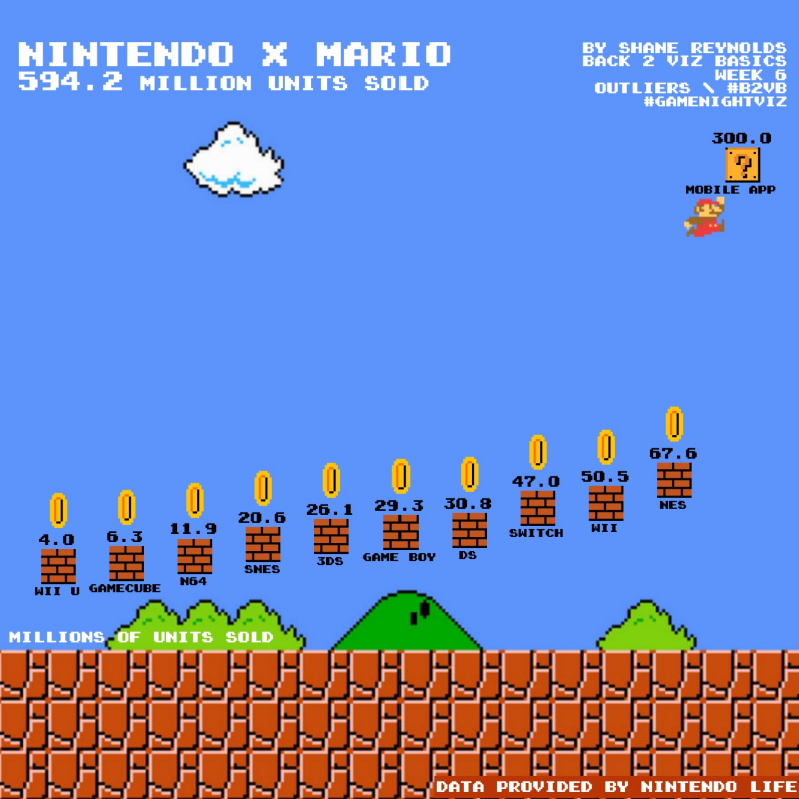</a>

<h3><a href='https://public.tableau.com/app/profile/stefan.melgaard/viz/SUPERMARIOOUTLIER/B2VBW6'>#B2VB Week 6 - Super Mario Outlier by Stefan Melgaard </a></h3><i></i><a href='https://public.tableau.com/app/profile/stefan.melgaard/viz/SUPERMARIOOUTLIER/B2VBW6'>
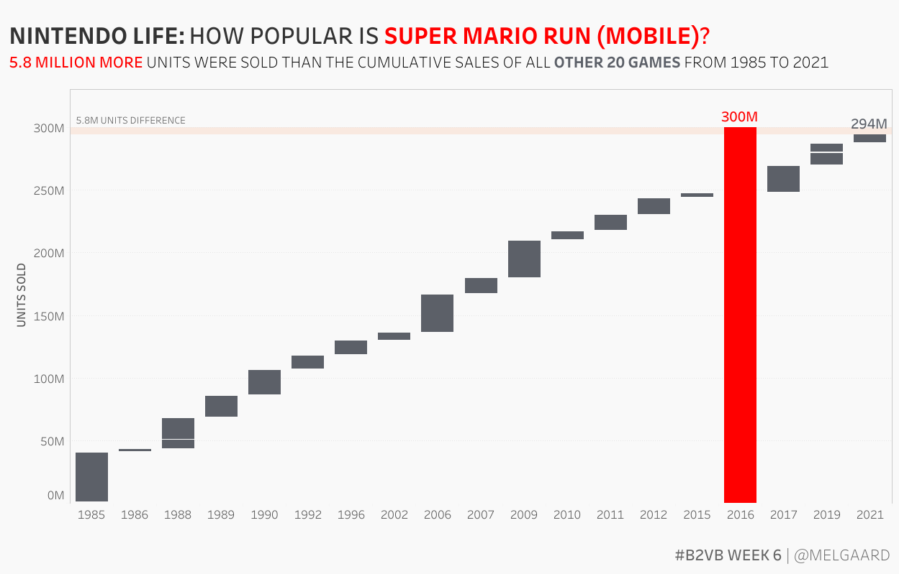</a>

<h3><a href='https://public.tableau.com/app/profile/stephanie.cairo/viz/NintendoLifesTopMarioGamesbyUnitsSoldB2VBWEEK6/NintendoLifesTopMarioGamesbyUnitsSold'>Nintendo Life’s Top Mario Games by Units Sold by Stephanie Cairo </a></h3><i></i><a href='https://public.tableau.com/app/profile/stephanie.cairo/viz/NintendoLifesTopMarioGamesbyUnitsSoldB2VBWEEK6/NintendoLifesTopMarioGamesbyUnitsSold'>
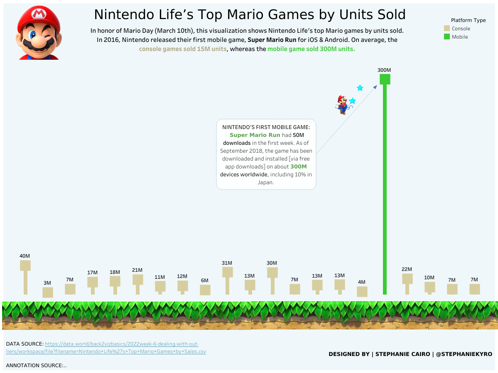</a>

<h3><a href='https://public.tableau.com/app/profile/tam.s.varga/viz/DealingwithOutliers/DealingwithOutliers'>B2VB - Dealing with Outliers by Tamás Varga </a></h3><i></i><a href='https://public.tableau.com/app/profile/tam.s.varga/viz/DealingwithOutliers/DealingwithOutliers'>
</a>

<h3><a href='https://public.tableau.com/app/profile/tavish1033/viz/B2VBWeek6-DealingWithOutliers/Mario'>#B2VB | Week 6 - Dealing With Outliers by Tavish Gupta </a></h3><i></i><a href='https://public.tableau.com/app/profile/tavish1033/viz/B2VBWeek6-DealingWithOutliers/Mario'>
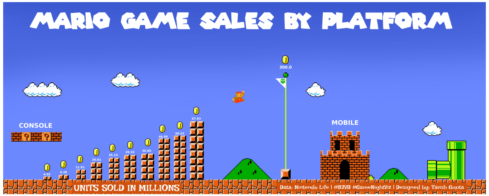</a>

<h3><a href='https://public.tableau.com/app/profile/wjsutton/viz/TheBestMarioGamesofAllTimeB2VBGamesNightViz/Dash'>The Best Mario Games of All Time | #B2VB & #GamesNightViz by Will Sutton </a></h3><i></i><a href='https://public.tableau.com/app/profile/wjsutton/viz/TheBestMarioGamesofAllTimeB2VBGamesNightViz/Dash'>
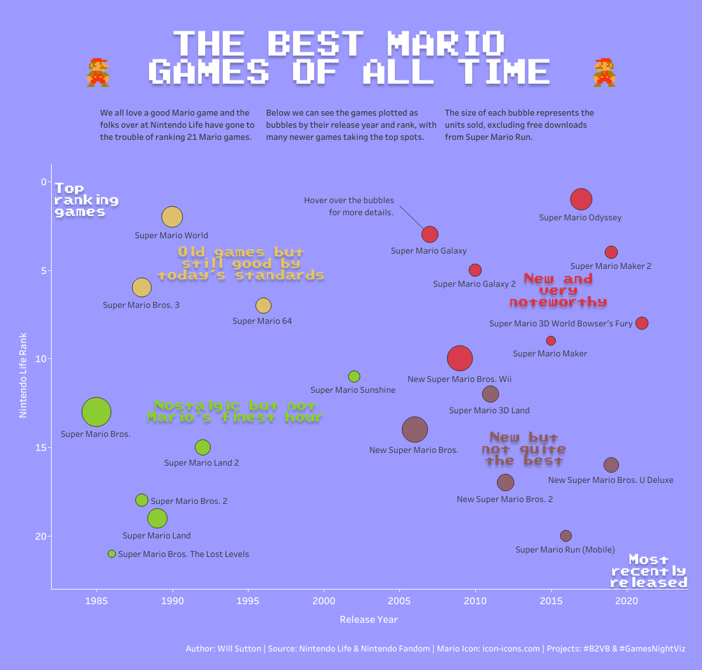</a>

<h3><a href='https://public.tableau.com/app/profile/wcbrown/viz/Outliers_16481468922780/OutliersDashboard#1'>Outliers by William Brown </a></h3><i></i><a href='https://public.tableau.com/app/profile/wcbrown/viz/Outliers_16481468922780/OutliersDashboard#1'>
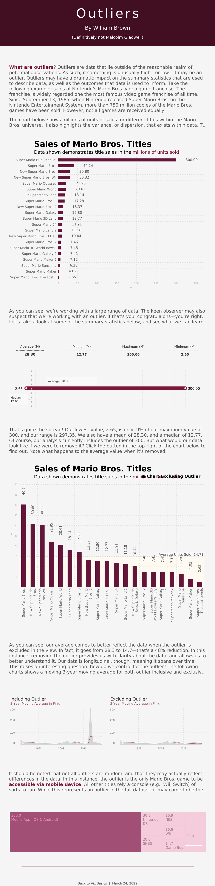</a>

<h3><a href='https://public.tableau.com/app/profile/yuko.nakamura/viz/B2VB2022Week6/B2VB2022Week6'>#B2VB 2022Week6 by Yuko Nakamura </a></h3><i></i><a href='https://public.tableau.com/app/profile/yuko.nakamura/viz/B2VB2022Week6/B2VB2022Week6'>
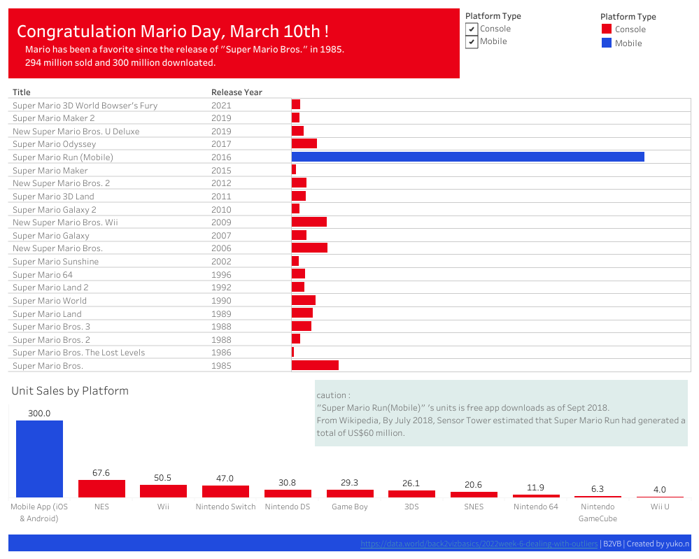</a>

