# Level 4: The Need for Speed
1st Apr - 31st May 2022

Our fourth #GamesNightViz theme ["The Need for Speed"](https://github.com/wjsutton/games_night_viz/blob/main/4_the_need_for_speed.md), had us in a race against time, aiming to be the fastest either through practice or a performance engine.

## Data Visualisation Submissions

We received 13 visualisations featuring
- lots of Mario vizzes from out [Time to complete dataset](https://github.com/wjsutton/games_night_viz/blob/main/4_the_need_for_speed.md#data-visualisation-challenge)
- with many great new authors joining the project
- as well as some of our regular authors back for another challenge

Check out these great vizzes, with commentary and insights from the super talented <a href='https://twitter.com/Visual_Endgame'>Tina Covelli</a> :point_down:

<h3><a href='https://public.tableau.com/app/profile/ant.pulley/viz/TableauSouls/PickCharacter'>Tableau Souls by Ant Pulley </a></h3><i></i><a href='https://public.tableau.com/app/profile/ant.pulley/viz/TableauSouls/PickCharacter'>
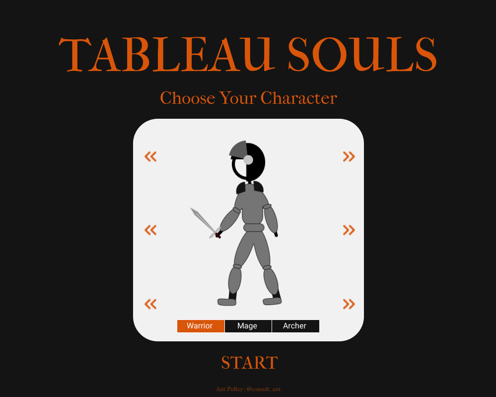</a>

<h3><a href='https://public.tableau.com/app/profile/ant.pulley/viz/MarioGames-CompletionTimes/MarioGamesTimetoComplete'>Mario Games - Completion Times by Ant Pulley </a></h3><i></i><a href='https://public.tableau.com/app/profile/ant.pulley/viz/MarioGames-CompletionTimes/MarioGamesTimetoComplete'>
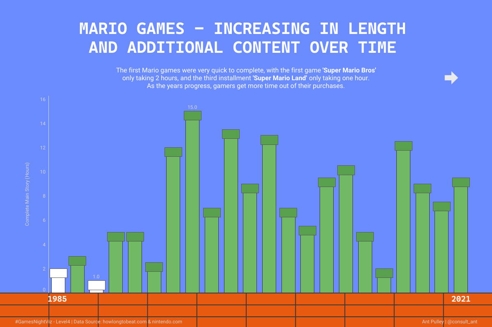</a>

<h3><a href='https://github.com/IcaroBernardes/gamesviz/blob/master/extras/oni/oxygen.png'>Oxygen Not Included - Klei Entertainment by Ícaro Bernardes </a></h3><i></i><a href='https://github.com/IcaroBernardes/gamesviz/blob/master/extras/oni/oxygen.png'>
</a>

<h3><a href='https://public.tableau.com/app/profile/joshpreston/viz/HowLongtoBeatMarioGames/Dashboard1'>How Long to Beat Mario Games? by Joshua Preston </a></h3><i></i><a href='https://public.tableau.com/app/profile/joshpreston/viz/HowLongtoBeatMarioGames/Dashboard1'>
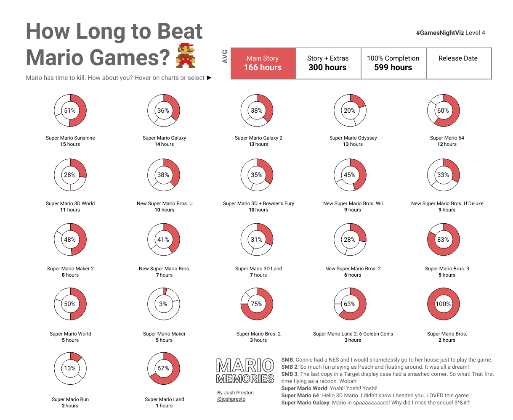</a>

<h3><a href='https://public.tableau.com/app/profile/joti.gautam/viz/Book3_16512272064090/Dashboard'>Cracking the Rubik's Cube by Joti Gautam </a></h3><i></i><a href='https://public.tableau.com/app/profile/joti.gautam/viz/Book3_16512272064090/Dashboard'>
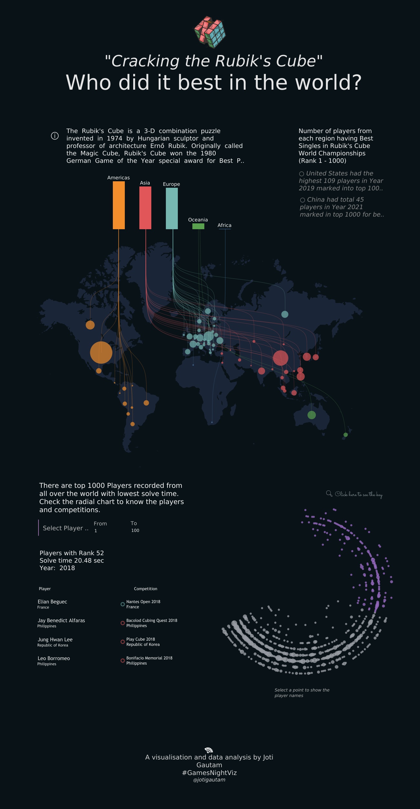</a>

<h3><a href='https://public.tableau.com/app/profile/jusztina.jud.k/viz/HowlongtocompleteMariogames/MarioGamesdashboard'>How Long to Complete Mario Games by Jusztina Judák </a></h3><i></i><a href='https://public.tableau.com/app/profile/jusztina.jud.k/viz/HowlongtocompleteMariogames/MarioGamesdashboard'>
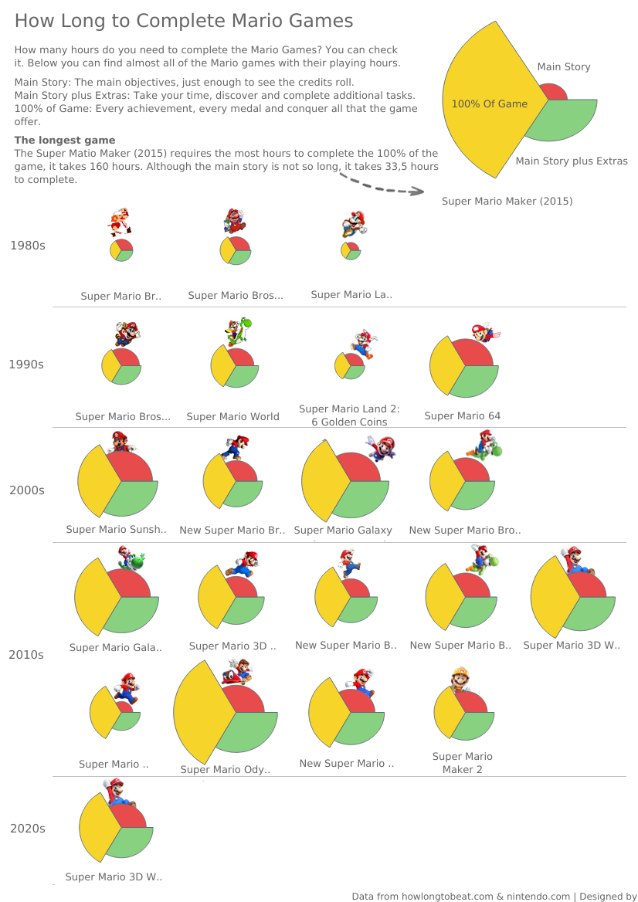</a>

<h3><a href='https://public.tableau.com/app/profile/nabilah.rahman/viz/MarioKartRaceTime/MK8'>Mario Kart Race Time by Nabilah Rahman </a></h3><i></i><a href='https://public.tableau.com/app/profile/nabilah.rahman/viz/MarioKartRaceTime/MK8'>
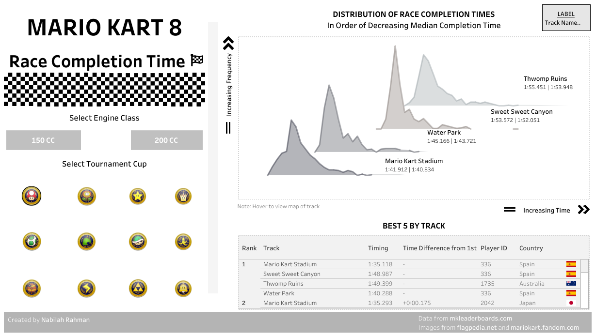</a>

<h3><a href='https://public.tableau.com/app/profile/nicholas.pillsbury/viz/GrandTheftAutoOnlineCarComparison/GTACarBrowsingDashboard'>Grand Theft Auto: Online Car Comparison by Nick Pillsbury </a></h3><i></i><a href='https://public.tableau.com/app/profile/nicholas.pillsbury/viz/GrandTheftAutoOnlineCarComparison/GTACarBrowsingDashboard'>
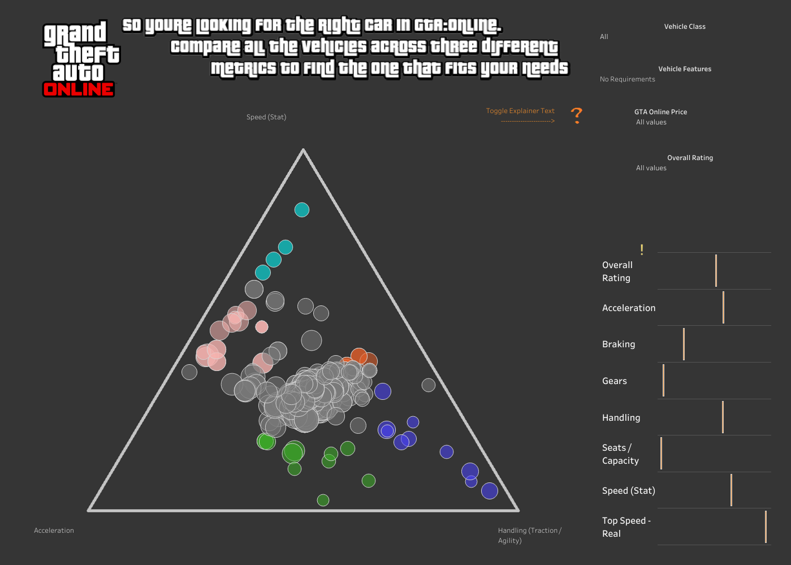</a>

<h3><a href='https://twitter.com/PaigeSmyth11/status/1528113994439053312'>Time to Complete Mario Platform Games by Paige Smyth </a></h3><i></i><a href='https://twitter.com/PaigeSmyth11/status/1528113994439053312'>
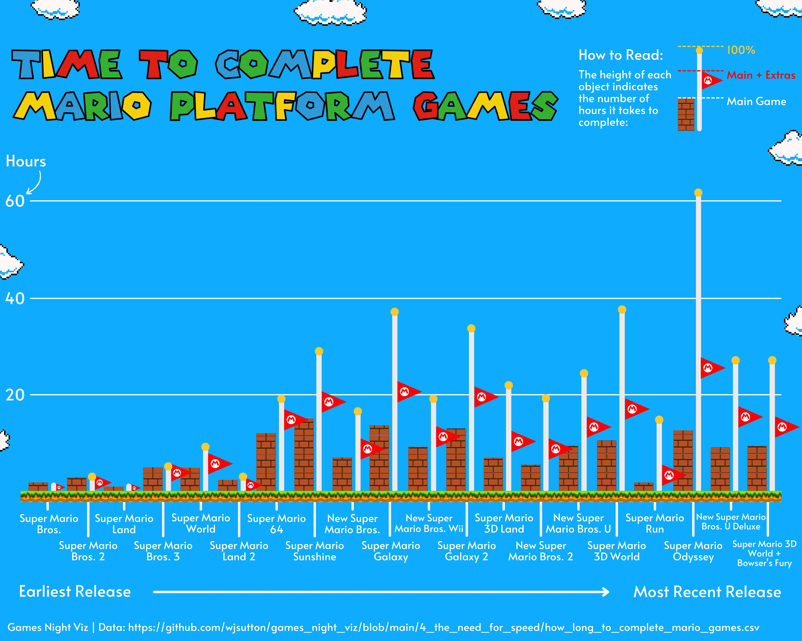</a>

<h3><a href='https://public.tableau.com/app/profile/paulbrianross/viz/YourNextFavoriteBoardGameGamesNightViz/BGG'>Your Next Favorite Board Game | #GamesNightViz by Paul Ross </a></h3><i></i><a href='https://public.tableau.com/app/profile/paulbrianross/viz/YourNextFavoriteBoardGameGamesNightViz/BGG'>
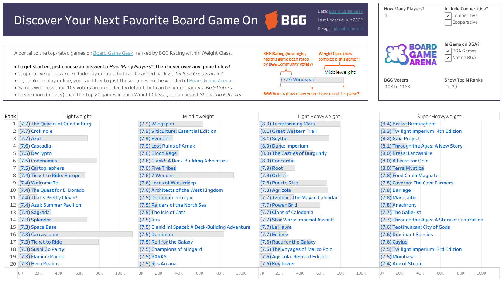</a>

<h3><a href='https://public.tableau.com/app/profile/rebecca.finlay/viz/HowlongtocompleteMariogames_16513044662080/MarioGameCompletionTimes'>How long to complete Mario games? by Rebecca Finlay </a></h3><i></i><a href='https://public.tableau.com/app/profile/rebecca.finlay/viz/HowlongtocompleteMariogames_16513044662080/MarioGameCompletionTimes'>
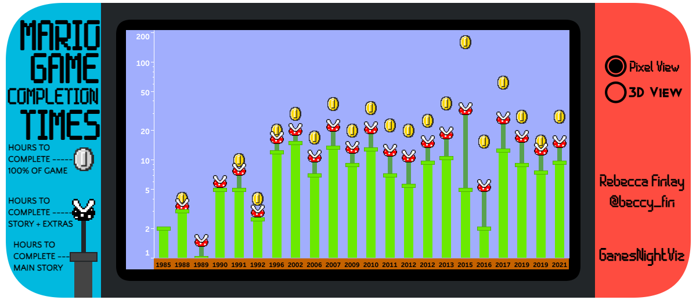</a>

<h3><a href='https://public.tableau.com/app/profile/shahid7759/viz/GottaCatchEmAll_16543605804030/GottaCatchEmAll'>Gotta Catch 'Em All! by Shahid Sheikh </a></h3><i></i><a href='https://public.tableau.com/app/profile/shahid7759/viz/GottaCatchEmAll_16543605804030/GottaCatchEmAll'>
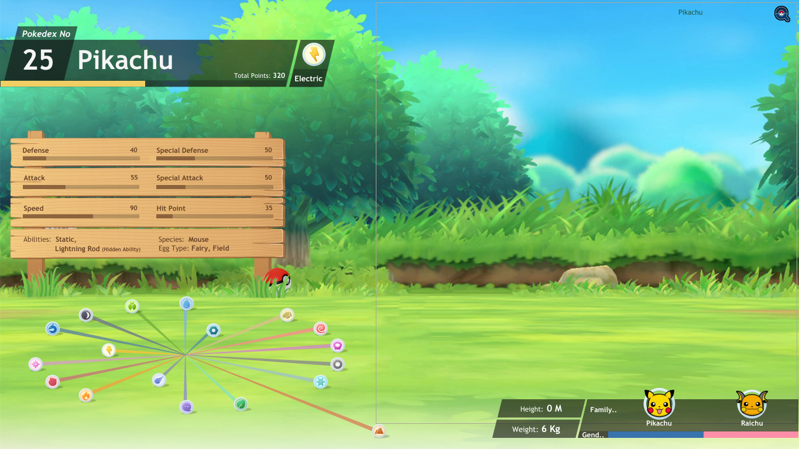</a>

<h3><a href='https://public.tableau.com/app/profile/turner.family/viz/Richardsgeniushourproject/RichardsGeniusHourProject'>Richard's genius hour project by Turner family </a></h3><i></i><a href='https://public.tableau.com/app/profile/turner.family/viz/Richardsgeniushourproject/RichardsGeniusHourProject'>
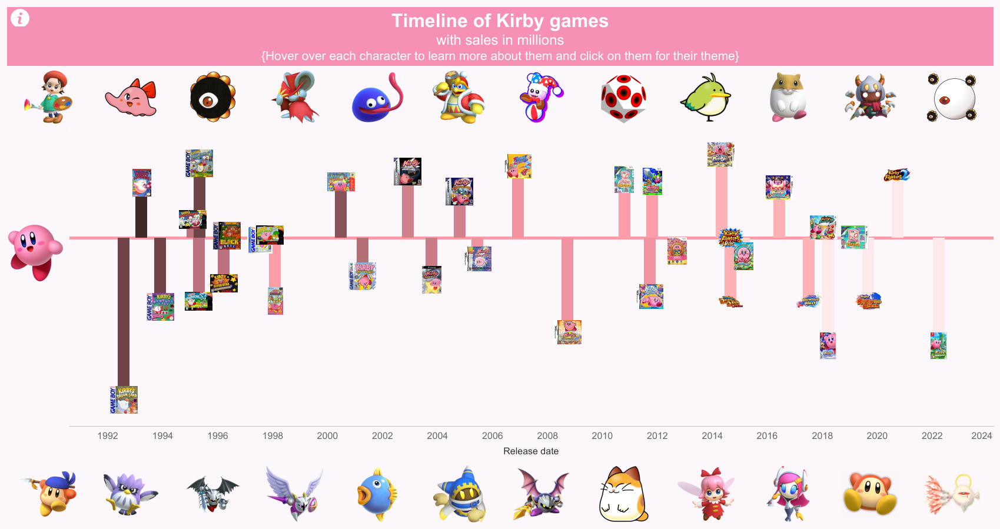</a>

