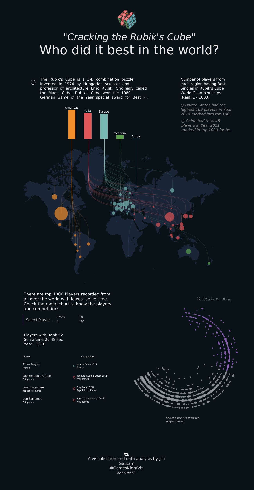

# Level 4: The Need for Speed
1st Apr - 31st May 2022

Our fourth #GamesNightViz theme ["The Need for Speed"](https://github.com/wjsutton/games_night_viz/blob/main/challenges/4_the_need_for_speed.md), had us in a race against time, aiming to be the fastest either through practice or a performance engine.

## Data Visualisation Submissions

We received 13 visualisations featuring
- lots of Mario vizzes from out [Time to complete dataset](https://github.com/wjsutton/games_night_viz/blob/main/challenges/4_the_need_for_speed.md#data-visualisation-challenge)
- with many great new authors joining the project
- as well as some of our regular authors back for another challenge

Check out these great vizzes, with commentary and insights from the super talented <a href='https://twitter.com/Visual_Endgame'>Tina Covelli</a> and <a href='https://mobile.twitter.com/ninjavizlouis'>Louis Yu</a> :point_down:

<h3><a href='https://public.tableau.com/app/profile/ant.pulley/viz/TableauSouls/PickCharacter'>Tableau Souls by Ant Pulley </a></h3><i>It’s no wonder Ant won the ‘22 Vizzie for “Wtf I never knew Tableau could do that” award. This viz, while deceivingly barebones, shows the raw potential of how map layers and dashboard actions can create a whole new dimension of interactivity. I’m speechless Ant… now build a game! (wait... He already <a href='https://public.tableau.com/app/profile/ant.pulley/viz/HappyMarioDay_16144683312270/HappyMarioDay'>did</a>) Louis
</i><a href='https://public.tableau.com/app/profile/ant.pulley/viz/TableauSouls/PickCharacter'>
</a>

<h3><a href='https://public.tableau.com/app/profile/ant.pulley/viz/MarioGames-CompletionTimes/MarioGamesTimetoComplete'>Mario Games - Completion Times by Ant Pulley </a></h3><i>The best thing about this visualization is the storytelling through animation. It is a fantastic interactive design by Ant that really runs with an intuitive narrative. Tina</i><a href='https://public.tableau.com/app/profile/ant.pulley/viz/MarioGames-CompletionTimes/MarioGamesTimetoComplete'>
</a>

<h3><a href='https://github.com/IcaroBernardes/gamesviz/blob/master/extras/oni/oxygen.png'>Oxygen Not Included - Klei Entertainment by Ícaro Bernardes </a></h3><i>Icaro just published his very first tableau viz for <a href='https://public.tableau.com/app/profile/.caro.bernardes/viz/B2VB_22_12/Dashboard1'>Pride Month</a>, so a very warm welcome to the Tableau family! However, don’t let that fool ya… he’s been churning out cool infographics for a while and his viz for this month’s flavor revolves around a game he’s passionate about. Kudos on procuring your very own dataset! The viz summarizes one of his playthroughs neatly in a systematic time series which oozes creativity and fun! I really like the wordplay on the title of the game to drive the message of the analysis. A couple of tips I would throw his way is:
  
- Creating some negative space between the title area and the viz to really “pop” it
- Aligning the source image and description together so it reduces cognitive fatigue
- Enhancing the red line or softening the rest of the lines so it ties in with the title better
  
Louis
</i><a href='https://github.com/IcaroBernardes/gamesviz/blob/master/extras/oni/oxygen.png'>
</a>

<h3><a href='https://public.tableau.com/app/profile/joshpreston/viz/HowLongtoBeatMarioGames/Dashboard1'>How Long to Beat Mario Games? by Joshua Preston </a></h3><i>Another viz with the use of animation here and it is so quick-responding. Animation works well with video game vizzes to immerse you more into the theme. It reminds me of a Mario Builder game, the way that the pie charts come together to update into donuts. Tina</i><a href='https://public.tableau.com/app/profile/joshpreston/viz/HowLongtoBeatMarioGames/Dashboard1'>
</a>

<h3><a href='https://public.tableau.com/app/profile/joti.gautam/viz/Book3_16512272064090/Dashboard'>Cracking the Rubik's Cube by Joti Gautam </a></h3><i>Joti wowed me with her <a href='https://public.tableau.com/app/profile/joti.gautam/viz/PokeMonPokeDex1-20ofGenOne/Dashboard2'>PokeDex</a> last year and I’m so glad she has finally done one for GamesNightViz! Taking a page from 2020 Iron Viz Christian’s winning <a href='https://public.tableau.com/app/profile/thecfelix/viz/TheAirWeBreatheIronVizFinal/TheAirWeBreatheIronVizFinal'>“The air we breathe”</a> viz, Joti cracked the code on who were the fastest Rubik's solvers in the world! The color scheme was very pleasant and tapped into our pre-existing image of a Rubik’s cube. The tooltips were minimalistic but powerful and that interactive spiral viz at the bottom was so fun to play with! It seems like the magic number for fast solvers is about 5 seconds… and that is awfully far from where I’m able to now! Louis</i><a href='https://public.tableau.com/app/profile/joti.gautam/viz/Book3_16512272064090/Dashboard'>
</a>

<h3><a href='https://public.tableau.com/app/profile/jusztina.jud.k/viz/HowlongtocompleteMariogames/MarioGamesdashboard'>How Long to Complete Mario Games by Jusztina Judák </a></h3><i>Small multiples create an effective story with this visualization, to easily show and gauge size. The addition of game imagery inserts a bit of nostalgia into the viz as well. Tina</i><a href='https://public.tableau.com/app/profile/jusztina.jud.k/viz/HowlongtocompleteMariogames/MarioGamesdashboard'>
</a>

<h3><a href='https://public.tableau.com/app/profile/nabilah.rahman/viz/MarioKartRaceTime/MK8'>Mario Kart Race Time by Nabilah Rahman </a></h3><i>A really good attempt in summarizing and analyzing the dataset by Nabilah! The monotone was a plus in getting the trends of the distribution curves out. The maps in the tooltip were a very nice touch to add context to the trends. A tip I would have for her is to shrink/simply the engine class/tournament cup (Don’t get me wrong, those were VERY fun!) so that the distribution chart is grabbing most of the user's attention. Louis</i><a href='https://public.tableau.com/app/profile/nabilah.rahman/viz/MarioKartRaceTime/MK8'>
</a>

<h3><a href='https://public.tableau.com/app/profile/nicholas.pillsbury/viz/GrandTheftAutoOnlineCarComparison/GTACarBrowsingDashboard'>Grand Theft Auto: Online Car Comparison by Nick Pillsbury </a></h3><i>It is exciting to see our first GTA Online visualization, considering how prominent this game is after several years. This map for the cars adds a layer of customization to the mix, by allowing the viewer to select the variables. Click a bubble within the circle to get specific vehicle details, which is a nice added touch. Tina</i><a href='https://public.tableau.com/app/profile/nicholas.pillsbury/viz/GrandTheftAutoOnlineCarComparison/GTACarBrowsingDashboard'>
</a>

<h3><a href='https://twitter.com/PaigeSmyth11/status/1528113994439053312'>Time to Complete Mario Platform Games by Paige Smyth </a></h3><i>Great work Paige, the aesthetics for this piece is really hitting all the notes! For Mario fans, this is really a no-brainer to grasp and for non-Mario fans, fret not! Nestled in the little corner at the top is a quick and easy explanation. What was interesting to me, is that the game designers kept a relatively constant core gameplay hours and Odyssey was the game that had so much content than previous titles. But in terms of video game sales, it was half of what the very first game (with substantially lesser content) sold. Louis</i><a href='https://twitter.com/PaigeSmyth11/status/1528113994439053312'>
</a>

<h3><a href='https://public.tableau.com/app/profile/paulbrianross/viz/YourNextFavoriteBoardGameGamesNightViz/BGG'>Your Next Favorite Board Game | #GamesNightViz by Paul Ross </a></h3><i>I really enjoy this viz and I think given the climate of the last few years with people looking for safe alternatives for indoor fun, this viz definitely deserves a review. There is so much detail to help a viewer select their next board game hidden within this dashboard. Really well done. Tina</i><a href='https://public.tableau.com/app/profile/paulbrianross/viz/YourNextFavoriteBoardGameGamesNightViz/BGG'>
</a>

<h3><a href='https://public.tableau.com/app/profile/rebecca.finlay/viz/HowlongtocompleteMariogames_16513044662080/MarioGameCompletionTimes'>How long to complete Mario games? by Rebecca Finlay </a></h3><i>Similarly to Paige, Rebecca tapped into the creative franchise that we all love and it’s really hard to pick a favorite as both were so intentionally well-designed! But what’s different with Rebecca’s rendition is she opted to use a logarithmic scale for the number of hours. Most people avoid that due to the potential of misrepresenting the weight of the values. However, it has worked pretty well in this case as Rebecca has included Super Mario Maker, which some would argue is not a core Mario game but I digress. This game has an even higher 160 hrs than Odyssey’s 60 hrs  to completion. And with the log scale, we can still see everything without the other games getting so squished! Louis</i><a href='https://public.tableau.com/app/profile/rebecca.finlay/viz/HowlongtocompleteMariogames_16513044662080/MarioGameCompletionTimes'>
</a>

<h3><a href='https://public.tableau.com/app/profile/shahid7759/viz/GottaCatchEmAll_16543605804030/GottaCatchEmAll'>Gotta Catch 'Em All! by Shahid Sheikh </a></h3><i>I love this visualization, it is so authentic to Pokemon and adding the gifs from each Pokemon into the viz adds to that authenticity. Even if you don’t play Pokemon, this one is so fun to navigate through because it feels like you’re actually playing on a console and you’re in the Pokedex! Tina</i><a href='https://public.tableau.com/app/profile/shahid7759/viz/GottaCatchEmAll_16543605804030/GottaCatchEmAll'>
</a>

<h3><a href='https://public.tableau.com/app/profile/turner.family/viz/Richardsgeniushourproject/RichardsGeniusHourProject'>Richard's genius hour project by Turner family </a></h3><i>I couldn’t believe it when I found out that firstly Richard is only 12 YEARS OLD, and two - he did this in an hour! Wait… what? The images on the bar charts were like icing on the cake! Will pointed out that the alternating axis helps to prevent overlaps and I couldn’t agree more. Though, just as a small tip I would throw out is having the same maximum range for both axes so it portrays the data weight more accurately. Also, the tooltips were packed with so much more information on the games and character profiles. So much fun, obviously he had a great <a href='https://twitter.com/JacobTurner80'>teacher!</a> Louis</i><a href='https://public.tableau.com/app/profile/turner.family/viz/Richardsgeniushourproject/RichardsGeniusHourProject'>
</a>

